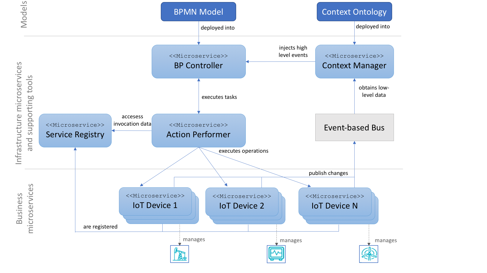

# IoT Enhanced Business Processes supported by BPMN and Microservices. Infrastructure

This repositry contains a software infrastructure to define an IoT-enhanced business proccess (BP). These BPs are defined in the IoT domain and multiple services, machines, and things can take the role and responsibility of performing some of the process tasks. An example using this infrastructure is available in the following Github repository: [iot-enhanced-business-process-example](https://github.com/pvalderas/iot-enhanced-business-process-example).

It has been implemented by using:

* [Spring Boot](https://spring.io/projects/spring-boot)
* [Netflix infrastructure](https://github.com/Netflix)
* [Camunda Engine](https://github.com/camunda/camunda-bpm-spring-boot-starter)
* [BPMN.io](https://github.com/bpmn-io)
* [RabbitMQ](https://www.rabbitmq.com/)

# About

This is the result of a reserach work leaded by Pedro Valderas at the PROS Research Center, Universitat Politècnica de València, Spain.

This work presents a modelling approach based on BPMN that reuses the concepts introduced by this language in order to model IoT-enhanced BPs. This modelling approach allows specifying IoT devices and both push and pull interactions between the process and Iot Devices, without modifying the BPMN metamodel. 

This modelling approach is suppoted by a microservice architecture aimed at facilitating the integration of business processes with the physical world that provides high flexibility to support multiples IoT device technologies, and facilitates evolution and maintenance.

#The modelling approach. Main guidelines

The main guidelines of the proposed modelling approach are the following:

* 1. A pool is used to represent the whole IoT-enhance business process within an organization.
* 2. Each IoT device or any other actor of an organization that participate in the process is represented by a lane of this pool.
* 3. Each IoT devices’ action is defined as a Service Task.
* 4. The execution of the Service Tasks that represents actions of IoT devices support pull interactions.
* 5. The physical world is represented by a collapsed pool.
* 6. Push interactions are represented by flow sequences whose source is the collapsed pool that represent the physical world and whose target is a message start event or a message intermediate catch event defined in a lane.


# The proposed architecture

The microservice architecture to support IoT-enhanced business proccess is shown below.



The architectural elements that support our proposal are depicted in red. Thery are the following:

* Service Registry: this microservice is in charge of maintaining the list of business microservice that there are in the system. For each microservice, this registry stores its invocation data. We used Netflix’s Eureka , which allows registering different instances of microservices. This registry also provides a REST API in order to interact with it through the HTTP protocol, which allows the Action Performer to access microservice invocation data easily. 

* BP Controller: this microservice is endowed with: (1) an adapted BPMN.io modeller to create IoT-enhanced business processes, and (2) a Camunda BPMN engine that is in charge of controlling the activity flow of the processes. This engine does not directly interact with business microservices. Instead it sends execution requests to the Action Performer microservice presented below. To do so, the only restriction that we must consider is that the service tasks associated to the lanes that represent actors should be bind to the API provided by the Action Performer microservice. 

* Action Performer: this microservice plays the role of middleware among the BP Controller, the Service Registry, and the business microservices. It publishes an API to which BPMN service tasks must be bind in order to execute an action. When a service tasks is executed by the BPMN engine of the BP Controller, this engine sends an execution request to the Action Performer, which interact with the Service Registry in order to know the invocation data of the required business microservice. Then, it calls the corresponding operation accessing the business microservice.

* Context Manager: this microservice is in charge of registering to the event-based bus in order to access the context changes published by business microservices. When a context change happens, this microservice registers it into an OWL-based context ontology which is continously analyzed in order to generate high level events. These events are injected into the BP Controller. 

* Event bus: it supports the asynchronous communication required by the infrastructure based on a publish/subscribe patter. The RabbitMQ  queue-based message broker is currently supported. 

* IoT microservices: they are the microservices in charge of controlling IoT devices. We support two type of interaction with IoT microservices: (1) Synchronously through REST invoations and (2) Asynchronously through publish/subscribe communicatio through the event bus.

In order to create the BP Controller, the Action Performer, the Context Manager and the Synchronous and Asychronous IoT microservices we provide the following tool-support.


# Creating a Business Process Controller

To create a BP Controller you can use Gradle to build the corresponding project in this repository and include it as a dependency of a Spring Boot Application. Then, you just need to annotate the main class with the ```@BPController``` as presented bellow. Note that the ```@SpringBootApplication``` annotation must be configured to find beans in the ```es.upv.pros.pvalderas.bpcontroller.server``` package.

```java
@BPController
@SpringBootApplication(scanBasePackages = {"es.upv.pros.pvalderas.bpcontroller.server"})
public class BPControllerMain {
  public static void main(String[] args) {
    SpringApplication.run(BPControllerMain.class, args);
  }  
}
```
Next, you must create an application.yml file, to name the microservice 'BPController' (mandatory name), indicate its HTTP port, define the the urls of both the Action Performed and the Context Monitor, and specify the configuration regarding to the service registry Eureka and the event bus.

```yml
spring:
  application:
    name: BPController
    
server:
  port: 8081
  
actionPerformer: 
  serviceUrl: http://localhost:8082/iot/microservice
  name: ActionPerformer
  
contextMonitor:
    serviceUrl: http://localhost:8083
    conditionPath: /context/query
  
eureka:
  client:
    serviceUrl:
      defaultZone: http://localhost:2222/eureka
    registerWithEureka: true
    fetchRegistry: true

eventBus:
  type: rabbitmq
  host: localhost
```
 
# Creating a Action Performer

To create a Global Composition Manager you can use Gradle to build the corresponding project in this repository and include it as a dependency of a Spring Boot Application. Then, you just need to annotate the main class with the ```@ActionPerformer``` as presented bellow. Note that the ```@SpringBootApplication``` annotation must be configured to find beans in the ```es.upv.pros.pvalderas.actionperformer.server``` package.

```java
@ActionPerformer
@SpringBootApplication(scanBasePackages = {"es.upv.pros.pvalderas.actionperformer.server"})
public class ActionPerformerMain {
  public static void main(String[] args) {
    SpringApplication.run(ActionPerformerMain.class, args);
  }   
}
```
Next, you must create an application.yml file to name the microservice 'ActionPerformer' (mandatory name), indicate its HTTP port, and define the configuration of the service registry Eureka and the event bus.

```yml
spring:
  application:
    name: ActionPerformer
    
server:
  port: 8082
  
eureka:
  client:
    serviceUrl:
      defaultZone: http://localhost:2222/eureka
    registerWithEureka: true
    fetchRegistry: true

eventBus:
  type: rabbitmq
  host: localhost
```

# Creating a microservice to support IoT devices controlled by a synchronous REST API

To create an IoT microservice that interact with the Action Performed through synchronous REST invocations you can use Gradle to build the corresponding project in this repository and include it as a dependency of a Spring Boot Application. Then, you just need to annotate the main class with the ```@SyncronousMicroservice``` as presented bellow. This annotation must be configured with the class object of the microservice HTTP controller. Note also that the ```@SpringBootApplication``` annotation must be configured to find beans in the ```es.upv.pros.pvalderas.microservice.syncronous``` package as well as the package in which the HTTP controller of the microservice is implemented (```es.upv.pros.pvalderas.truckcontainer``` in the example below). In addition, the ```@EnableDiscoveryClient``` annotation is used to register the microservice in Eureka.

```java
@EnableDiscoveryClient
@SpringBootApplication(scanBasePackages = {"es.upv.pros.pvalderas.truckcontainer","es.upv.pros.pvalderas.microservice.syncronous"})
@SyncronousMicroservice(serviceAPIClass=TruckContainerSensorHTTPController.class)
public class TruckContainerSensor {
  public static void main(String[] args) {
    SpringApplication.run(TruckContainerSensor.class, args);
  } 
}
```
Next, you must create an application.yml file, indicating the name of the microservice (which is shown in the BPMN editor provided by the BPController), indicate its HTTP port, and define the configuration of the service registry Eureka.

```yml
spring:
  application:
    name: TruckContainer
    
server:
  port: 8091
    
eureka:
  client:
    serviceUrl:
      defaultZone: http://localhost:2222/eureka
  instance:
    metadataMap:
      connectionType: synchronous
```

# Creating a microservice to support a IoT device controlled by an asynchronous pub/sub broker

To create an IoT microservice that interact with the Action Performer through a pub/sub communication you can use Gradle to build the corresponding project in this repository and include it as a dependency of a Spring Boot Application. Then, you just need to annotate the main class with the ```@AsyncronousMicroservice``` as presented bellow. This annotation must be configured with the class object of API that describe the operation provided by the microserive. Note also that the ```@SpringBootApplication``` annotation must be configured to find beans in the ```es.upv.pros.pvalderas.microservice.asynchronous``` package as well as the package in which the HTTP controller of the microservice is implemented (```es.upv.pros.pvalderas.refrigerator``` in the example below). In addition, the ```@EnableDiscoveryClient``` annotation is used to register the microservice in Eureka.

```java
@EnableDiscoveryClient
@SpringBootApplication(scanBasePackages = {"es.upv.pros.pvalderas.refrigerator","es.upv.pros.pvalderas.microservice.asynchronous"})
@AsynchronousMicroservice(serviceAPIClass=RefrigeratorControlSystemAPI.class)
public class RefrigeratorControlSystem {
  public static void main(String[] args) {
    SpringApplication.run(RefrigeratorControlSystem.class, args);
  }
}
```
Next, you must create an application.yml file and define the name of the microservice (which is shown in the BPMN editor provided by the BPController), indicate its HTTP port, create the configuration of the service registry Eureka and the event bus, and define the url of the BPController used to complete BPMN tasks.

```yml
spring:
  application:
    name: Refrigerator
    
server:
  port: 8092
    
eureka:
  client:
    serviceUrl:
      defaultZone: http://localhost:2222/eureka
  instance:
    metadataMap:
      connectionType: asynchronous

eventBus:
  type: rabbitmq
  host: localhost
 
bpController:
  serviceUrl: http://localhost:8081
  asyncTaskPath: /process/asynctask/
```


# Using the infrastructure to create and execute a microservice composition

In [iot-enhanced-business-process-example](https://github.com/pvalderas/iot-enhanced-business-process-example) you can find the implementation of a case study based on the process of purchase orders.
